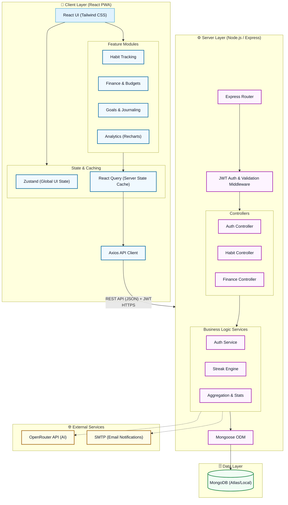

# TickMark 🎯

A production-ready, cross-platform comprehensive application for Habit Tracking, Personal Finance Management, Goals, and Journaling. 

## 📖 Table of Contents
- [Overview](#overview)
- [Architecture & Tech Stack](#architecture--tech-stack)
- [Project Structure](#project-structure)
- [Core Modules & Flow](#core-modules--flow)
- [Getting Started](#getting-started)
- [Environment Configuration](#environment-configuration)
- [Development Workflow](#development-workflow)

## Overview

TickMark is designed to be your all-in-one personal productivity and tracking dashboard. It combines several modules—Habits, Finance (Expenses, Income, Budgets, Trips), Goals, and Journaling—under one unified interface. 

The application utilizes a modern tech stack to provide a fast, responsive, and installable PWA experience on the frontend, backed by a robust REST API on the backend.

## Architecture & Tech Stack

TickMark follows a classic Client-Server architecture with a NoSQL database.



### Frontend (Client)
- **Framework:** React 18 + Vite (TypeScript)
- **Styling:** Tailwind CSS for utility-first, responsive, and dynamic (Light/Dark mode) styling.
- **State Management:** 
  - **Zustand** for global client-side state (e.g., UI toggles, theme, user session).
  - **TanStack Query (React Query)** for server-state management, caching, and data synchronization.
- **Charts:** Recharts for analytics and data visualization.
- **PWA:** `vite-plugin-pwa` + Workbox for offline capabilities and installability.
- **Routing:** React Router for client-side navigation.

### Backend (Server)
- **Runtime:** Node.js
- **Framework:** Express.js with TypeScript for strong typing and better developer experience.
- **Database:** MongoDB (using Mongoose for object modeling).
- **Authentication:** JWT (JSON Web Tokens) with bcrypt for password hashing.
- **Architecture Pattern:** Controller-Service-Model architecture ensuring separation of concerns.

## Project Structure

```text
tickmark/
├── client/                 # React frontend workspace
│   ├── src/
│   │   ├── api/            # Axios instances and API call definitions
│   │   ├── components/     # Reusable UI components
│   │   ├── pages/          # Page-level components (Dashboard, Finance, Habits, etc.)
│   │   ├── services/       # Client-side business logic
│   │   ├── store/          # Zustand store definitions
│   │   └── types/          # TypeScript interfaces and types
├── server/                 # Express backend workspace
│   ├── src/
│   │   ├── config/         # Environment and DB configuration
│   │   ├── controllers/    # Request handlers parsing inputs and returning responses
│   │   ├── middleware/     # Express middlewares (Auth, Error handling, Validation)
│   │   ├── models/         # Mongoose schemas (User, Habit, Expense, Goal, etc.)
│   │   ├── routes/         # API endpoint definitions mapped to controllers
│   │   └── services/       # Backend business logic and database interactions
└── package.json            # Root configuration
```

## Core Modules & Flow

The flow of data generally follows this path:
**Client (React Component) ➔ API Call (React Query) ➔ Server Route ➔ Controller ➔ Service ➔ Database (MongoDB)**

### 1. Authentication & Users
- **Purpose:** Secure user accounts and personalized data.
- **Flow:** Users register/login via the `/auth` endpoints. A JWT is issued and stored securely on the client. All subsequent protected API calls include this token in the Authorization header.

### 2. Habit Tracking
- **Purpose:** Monitor daily routines with different tracking types (binary, quantity, count, duration, avoidance).
- **Flow:** Users configure habits. The engine calculates streaks based on customized schedules. Completions are logged via the `HabitCompletion` model and visualized in the `Track` and `Analytics` pages.

### 3. Financial Management
- **Purpose:** Comprehensive expense and income tracking, budgeting, and trip-specific finances.
- **Flow:** Transactions are recorded as `Expense`, `Income`, or `TripExpense`. They are categorized and tagged. The dashboard aggregates this data to show financial health and budget utilization.

### 4. Goals & Journaling
- **Purpose:** Long-term objective tracking and daily reflections.
- **Flow:** Goals are stored with target metrics. Journal entries provide a rich-text space for daily logs, tied to specific dates.

## Getting Started

### Prerequisites
- Node.js 18+
- MongoDB (Atlas connection string OR local MongoDB instance)

### 1. Clone & Install

```bash
git clone <repo>
cd tickmark

# Install dependencies for both client and server
npm install
cd client && npm install
cd ../server && npm install
```

### 2. Configure Backend

```bash
cd server
cp .env.example .env
```
Edit the `.env` file to include your `MONGO_URI`, `JWT_SECRET`, and other relevant keys (e.g., SMTP details for emails, OpenRouter API key if AI features are enabled).

### 3. (Optional) Seed Demo Data

To populate the database with sample data for testing:
```bash
cd server
npm run seed
```

### 4. Start Development Servers

You can start both frontend and backend concurrently from the project root (if configured) or in separate terminals:

**Terminal 1 (Backend):**
```bash
cd server
npm run dev
# Runs on http://localhost:5000
```

**Terminal 2 (Frontend):**
```bash
cd client
npm run dev
# Runs on http://localhost:5173
```

## Environment Configuration

Key environment variables in `server/.env`:
- `MONGO_URI`: Connection string for MongoDB.
- `JWT_SECRET`: Secret key for signing tokens.
- `PORT`: Backend port (default 5000).
- `CLIENT_URL`: Allowed CORS origin (default http://localhost:5173).
- `OPENROUTER_API_KEY`: API key for AI integrations.

## Development Workflow
1. **Adding a Feature:** 
   - Define the Mongoose schema in `server/src/models`.
   - Create the service logic in `server/src/services`.
   - Expose it via a controller and route.
   - On the client, define the TypeScript interface in `client/src/types`.
   - Add the API call in `client/src/api`.
   - Use `useQuery` or `useMutation` in the relevant React component.
2. **Styling:** Use Tailwind CSS utility classes directly in the `className` prop of your components.
3. **State:** Prefer React Query for server data and Zustand only for purely client-side UI state.
